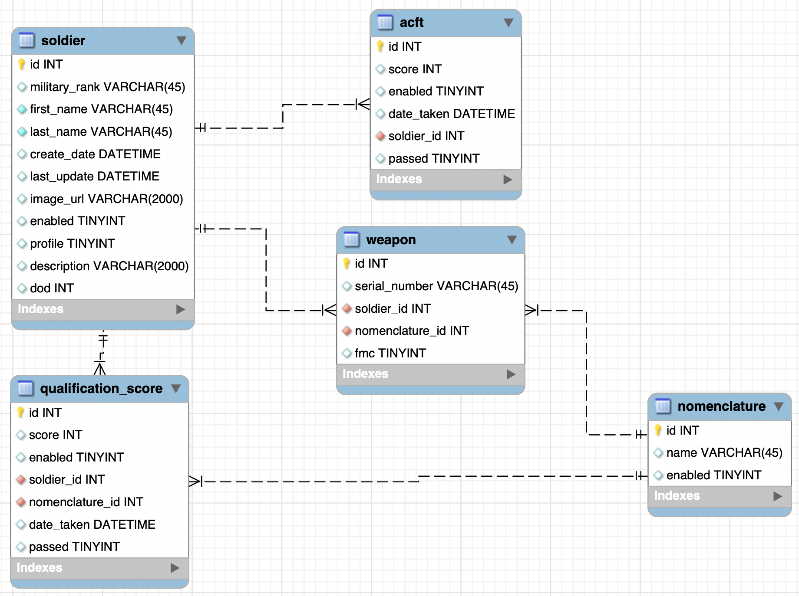

# EventTrackerProject

## Overview

Week 12 homework for Sill Distillery.

Full-stack project using MySQL, Spring Boot, Spring Data JPA.

## How to run
* To start the website run the following command from the ngSoldier directory
  * ng serve -o --port=8085
* From the Main page, all of the service members in the platoon are shown.
* The information displayed is rank, first and last name, DOD number, and image.
* If the service members image is clicked detailed view will be shown.
  * From here the user is given the option to edit the service members information, delete the service member, or return to the platoon table view.
* below the Platoon Table is the create soldier form.  When all the soldiers information is entered the new service member will be added to the Platoon table
* Below the create soldier table is the Platoon Data button. Upon pressing, the user will be shown Platoon statistics.
 * The user can view the Platoon's ACFT average score and the count of the service members in the platoon
 * Additionallay The user can view the platoon by their rank through the drop down menu. 

## Postman Test URLs
* In Postman, you may view all, view by id, add, update, and delete a new Soldier data entry
* View All Soldiers
  * Request: GET, URL: http://localhost:8085/api/soldiers
* View Soldier by ID
  * Request: GET, URL: http://localhost:8085/api/soldier/7
* Create new Soldier
  * Request: POST, URL: http://localhost:8085/api/soldier
* Update Soldier By ID
  * Request: PUT, URL: http://localhost:8085/api/soldier/7
  * Add a Body set to Raw JSON type
* Delete Soldier by ID from DataBase
  * Request: DELETE, URL: http://localhost:8085/api/soldier/7
* Un-Enable Soldier
  * Request: DELETE, URL: http://localhost:8085/api/soldierun/7

## HTML/JavaScript Front End using XHR/AJAX
* User can Calculate the ACFT Physical Fitness Test Score for the entire platoon entered into the database.  Each soldier has a ACFT List, so this takes their last entered test scores of each soldier.
* User can create a soldier and enter them into the Database.  The soldier when entered will be shows in the table below.
* Soldier table shows active members of the Platoon.  WHen a soldier's row is clicked more information from the solider is shown below.
* When a soldier is selected from the table the user is given the ability to edit or delete the current soldiers values.
##Database Schema 

./src/main/resources/static/images/your-image-name.png
## REST Endpoints
| HTTP Verb | URI                  | Request Body | Response Body | Response Codes |
|-----------|----------------------|--------------|---------------|----------------|
| GET       | `/api/soldiers`      |              | List Soldiers    | 200 |
| GET       | `/api/soldier/4`   |              | Representation of soldier `4` | 200, 404 |
| POST      | `/api/soldier`      | Representation of a new _soldier_ resource | Representation of created _soldier_ | 201, 400 |
| PUT       | `/api/soldier/4`   | Representation of a new version of _soldier_ `4` | Representation of updated _soldier_ | 200, 404, 400 |
| DELETE    | `/api/soldier/4`   |              | | 204, 404, 400 |
## Technologies Used

* Java
* STS: Spring Tool Suite
* JPA: Java Persistence API
* MySQL, MySQL Workbench
* AWS
* git, GitHub

## Lessons Learned
* Both a hard delete and a "set enabled to false" method will be useful for most applications.  THe hard delete method will probably be only given to admin users and the applicaiton users will have access to the alternate delete method.
* Database construction needs to be done very deliberately and thoughtfully.  Every field and table should have an application to a planned feature as entity creation and testing can be time consuming.
* Obtaining the correct error responses can be complicated. Methods returning objects or null and then subsequent methods performing null checks seems to be a good route to ensure that the proper errors are outputed
* Reading the console output is critical for tracking down issues, especially that user stories are stretching through multiple java files.
* Syntax in the java script file must be done extra carefully as there is limited compiler or error information.
* JsonIgnore will block fields being transfered to the JavaScript side of the program.  In the future it seems I will need to make additional controller mappings to circumvent this issue.

## Where to go from here
* I think there is a market for a consolidated user friendly App for military personel to track service member and equipment information.  I would like this app to be able help facilitate this need.

